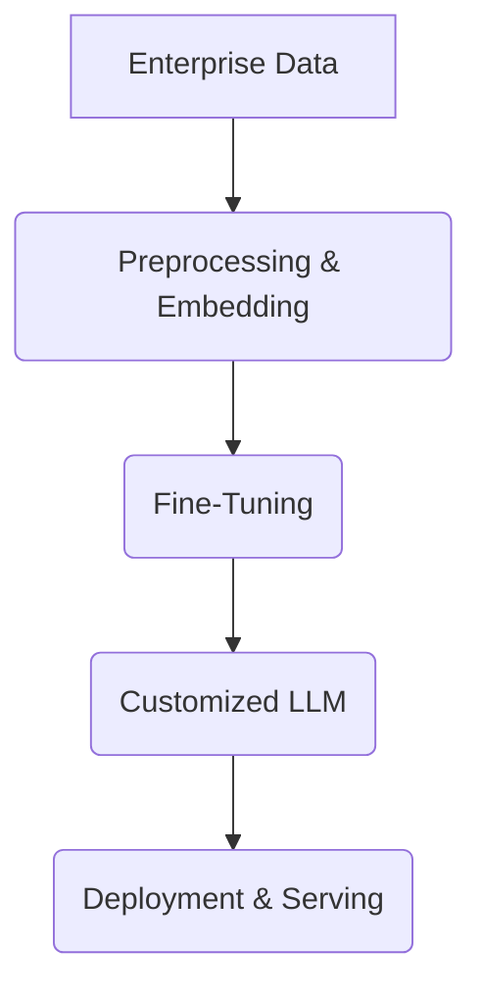

# RAG, Fine-Tuning, and the Enterprise

## Introduction

What does this rag and some fine-tuning screwdrivers have to do with AI? Well, nothing directly, but they effectively illustrate one of the biggest challenges with large language models and how Retrieval-Augmented Generation (RAG) and fine-tuning of LLMs can help address it.

## Key Challenges

1. **Grounding the LLM** in real-world enterprise data.
2. **Ensuring accurate outputs** by providing the right data in return.

The goal is to deliver actual information on RAG and fine-tuning—not an actual rag and screwdrivers.

## Why RAG & Fine-Tuning?

RAG and fine-tuning are the current best path forward for AI in the enterprise. They enable:

- Contextual grounding in proprietary datasets.
- Customized behavior through targeted model updates.
 

### RAG Pipeline Overview

```mermaid
flowchart LR
  Q([User Query]) --> RETR(Retriever)
  RETR --> VS[(Vector Store)]
  VS --> RETR
  RETR --> CONTEXT[Retrieved Context]
  CONTEXT --> GEN([Generator (LLM)])
  GEN --> A([Answer])
```

### Fine-Tuning Pipeline



## Course Roadmap

In this course, we’ll take a high-level conceptual approach to these topics to help make sense of it all. Let’s get cracking!
