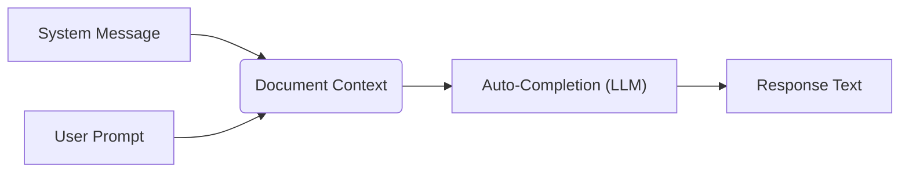
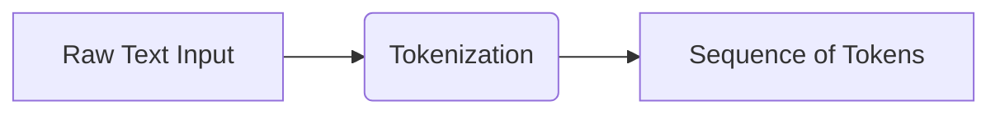
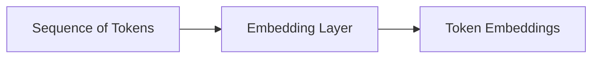
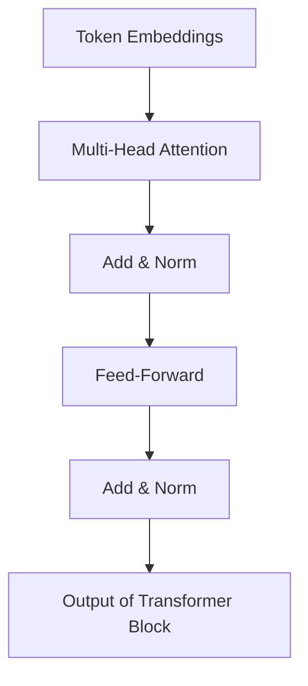
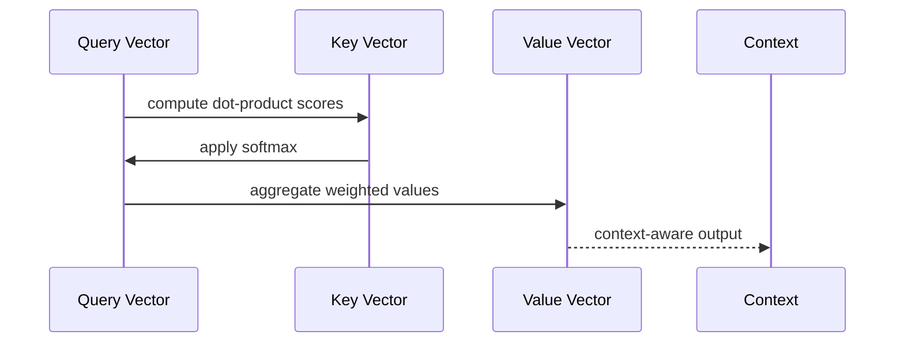
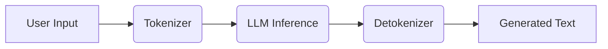

# HOW LLMs Work

## Introduction

Large Language Models (LLMs) are powered by the Transformer architecture, enabling them to process and generate human‑like text. In this section, we’ll walk through each stage of an LLM pipeline—from raw text to generated output—and dive into the core Transformer building blocks.

## Why Understanding LLMs Matters

To understand RAG and fine-tuning, it’s important to understand how these concepts emerged—we must start grounded in how LLMs work at a practical level. When you interact with an LLM through an app like ChatGPT, it feels as if you’re chatting with a real person. You ask a question, it responds, and then you carry on a conversation. This back-and-forth produces a sense that the LLM possesses true reasoning and intelligence.

However, when the model’s output becomes imprecise or outright incorrect—yet remains 100% confident—it can feel like the system is lying or, as we often say, hallucinating. This mental model of the LLM leads us astray when designing and using LLM-based systems.

### LLMs as Advanced Auto-complete

Large language models implemented as chat applications are essentially sophisticated auto-complete systems. At the start of a new chat, the LLM has a system message—effectively the first part of the document. When you send a prompt (e.g., "What ingredients do I need to bake a cake?"), the LLM reads the system message, then your query, and auto-completes the document.

What looks like recipe knowledge is really probabilistic completion based on patterns seen during training. Because millions of cake recipes were part of its training data—and most recipes share similar ingredients—the chance of an accurate generic cake ingredient list is high. But this is math, not true intelligence.

## 1. Tokenization

Raw text is first split into discrete tokens (words, subwords, or characters) before being fed to the model.

## 2. Embedding

Each token is mapped to a high-dimensional vector that encodes semantic information.

## 3. Transformer Block

The core Transformer block applies self-attention and feed-forward layers in sequence, along with residual connections and layer normalization.

## 4. Self-Attention Mechanism

Self-attention computes a weighted sum of values, where weights are determined by the similarity of queries and keys.

## 5. Inference Pipeline

At inference time, LLMs tokenize input, run it through stacked Transformer blocks, and decode tokens back to text.

## Summary

This end-to-end pipeline—from tokenization through embedding, multi-head attention, and decoding—enables LLMs to understand context and generate coherent text.
