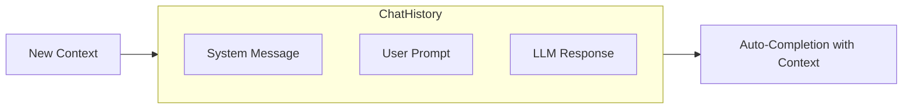
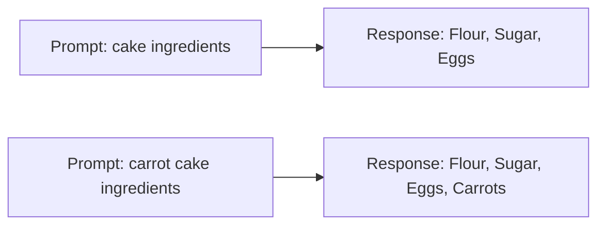
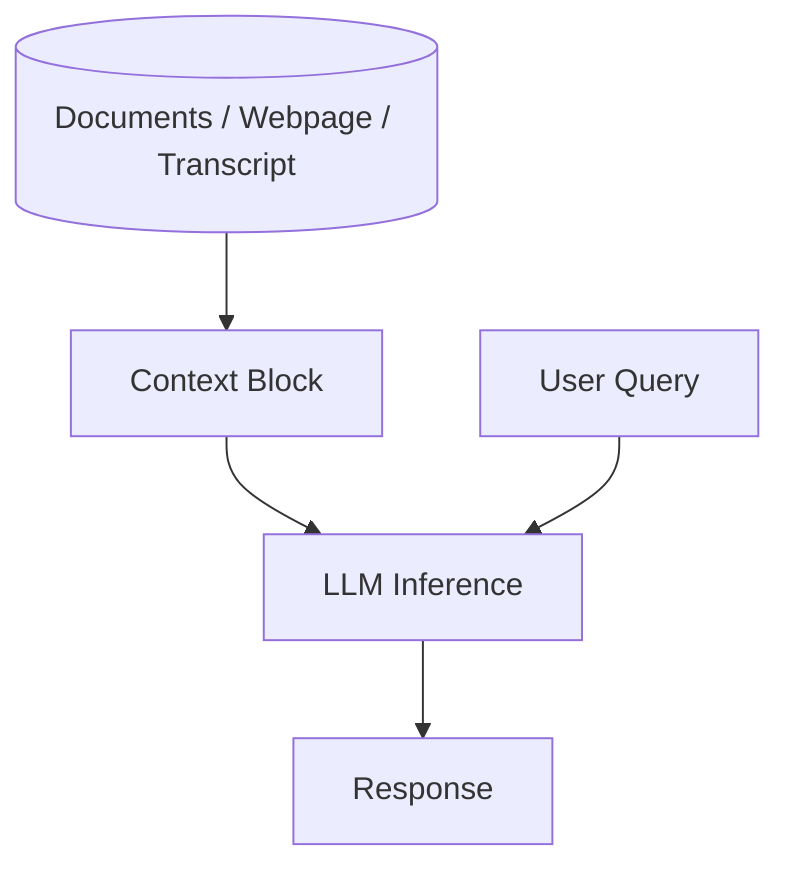

# Context Makes All the Difference

## Core Idea

Providing context to an LLM dramatically improves the relevance and accuracy of its output. Just as we narrow our conversations with friends by adding details, LLMs leverage contextual cues to guide their probabilistic text completions.

## Everyday Analogy

When you want to bake a cake, you don’t ask, “What are the ingredients for cake?” You specify which cake by saying, “What are the ingredients for a carrot cake?” The word “carrot” provides crucial context that changes the recipe.

## Prompt Engineering

Prompt engineering is simply the art of providing the right context (system messages + user instructions + documents) so that the LLM’s auto-completion stays on target.

## Takeaway

Any time you find an LLM answer going off-track, consider what additional context you can supply. That simple act is often enough to steer the model back in line.
