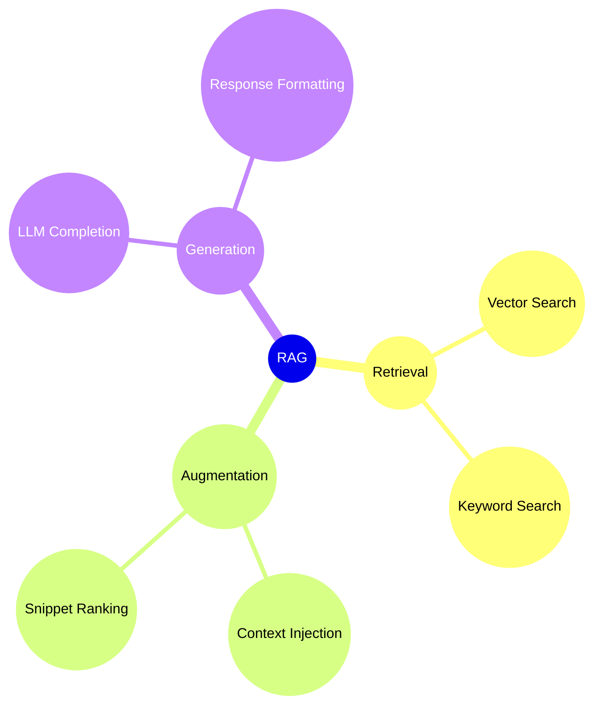
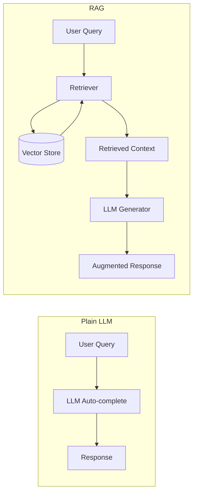

# RAG: Retrieval Augmented Generation

## What is an LLM & Language Transformer?

A Large Language Model (LLM) is a deep neural network trained on massive text corpora to model and generate human-like language. At its core, an LLM uses the **Transformer** architecture: a stack of self-attention and feed-forward layers with residual connections, enabling the model to capture long-range dependencies and context when processing text. Rather than looking up facts in a database, a language transformer predicts the next token in a sequence based on learned patterns, which allows it to generate coherent and contextually relevant responses.

People tend to treat chat-based LLM systems as a combination of a search engine and a knowledgeable and skilled assistant. They ask the LLM to answer questions or ask you to perform some task and often combine the two. The trouble is, and I explained this earlier, the LLM isn’t a knowledge lookup system, it’s a language transformer. It doesn’t actually know anything, it just has this complex enough map of our language to be able to auto complete most sentences in a way that is mostly correct, as long as the pattern of the information was readily available and prevalent in its training data. This is a challenge because for us users of AI systems, incorrect information presented with 100% confidence reads at best like hallucination, and at worst like a blatant lie.

The good news is we already know how to make the output far more accurate. Remember, context makes all the difference. If instead of immediately answering, the AI service were to retrieve information from a knowledge base, add that information into its context, and then generate a response based on that new context, the response would be far more accurate.

An early version of this concept was introduced with the Bing AI system. When you ask a question, it searches the web for relevant information, then uses that information to provide the answer. It retrieves information, augments the data, and then generates a response. Retrieval, Augmented, Generation — this is the light bulb moment.

This approach isn’t confined to search engines. We can build LLM systems that retrieve data from any structured data source and augment it in whatever way we specify so they generate responses that fit our needs.
## Core Idea

RAG combines retrieval from external data sources with LLM generation to provide accurate, up-to-date, and context-grounded responses.

## RAG Mindmap

## RAG vs Plain LLM

## Key Takeaway

Whenever you need precision and up-to-date information, RAG grounds generative models in real data—boosting both accuracy and reliability.
