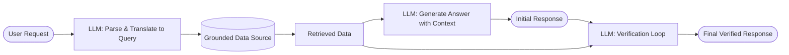

# The RAG Flow

## Core Idea

Understand how RAG systems translate free-form requests into data lookups and then ground LLM generations in the retrieved data—optionally adding a verification loop to curb hallucinations.

## RAG Flowchart

## Step-by-Step Explanation

1. **Parse & Translate:** The LLM reads the incoming request and converts it into a structured query for the attached knowledge base or API (the “grounded truth”).
2. **Retrieve Data:** The grounded data source—whether a vector store of embeddings, a traditional database, or even a static document like a cookbook—executes the query and returns the relevant snippets.
3. **Generate Answer:** The LLM merges the original request with the retrieved data and produces an initial response, now grounded in real facts.
4. **Verification Loop (optional):** To further reduce hallucinations, the LLM is prompted again with both the retrieved data and its own draft answer, verifying (and revising) that every statement is supported by the source.

## Analogy: LLM with a Cookbook

> Think of RAG as giving the LLM a cookbook when you ask for carrot cake ingredients. If the recipe is in the book, the LLM will almost always reproduce the correct list—rather than guessing it from statistical patterns alone.

## Key Takeaway

By structuring requests as data lookups and grounding generations in retrieved content (with an optional verification pass), RAG dramatically boosts factual accuracy and reliability.
