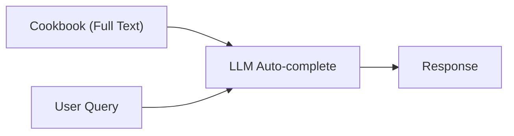
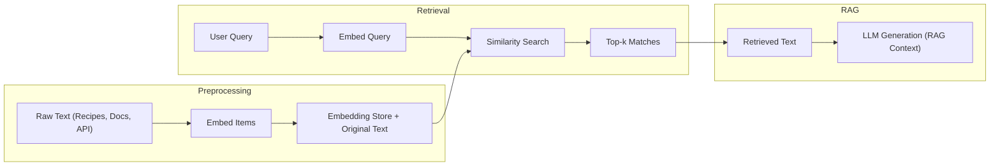
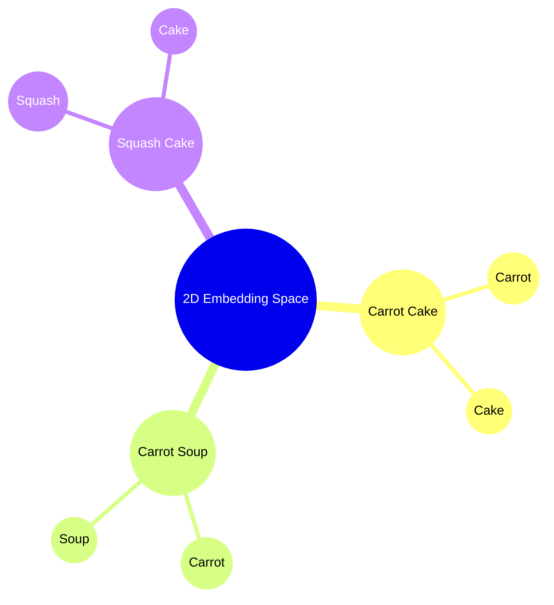

# Embeddings: Helping AI Understand Data

## What Are Embeddings?

Embeddings are fixed-size numerical vectors that represent pieces of text (words, sentences, or documents) in a continuous, multidimensional space. By converting text into embeddings, we can measure semantic similarity via simple distance or similarity computations (e.g., cosine similarity).

## Why Use Embeddings in RAG?

- **Disambiguation & Relevance:** Embeddings let both the LLM and the retrieval system focus on the most semantically relevant content (e.g., isolating carrot cake recipes vs. carrot soups).  
- **Scalability:** Unlike stuffing an entire document into context, embeddings enable efficient nearest-neighbor lookup over large corpora.

## Naive Context Window (Not Scalable)

Before embeddings, you could load the entire document into the LLM’s context and rely on auto-complete. For small texts this may work, but it quickly becomes impractical:

- Consumes too much context space, leaving minimal room for prompts.  
- Inefficient and costly for large corpora.  

## Embedding & Retrieval Pipeline

## 2D Embeddings Example

Consider a toy 2D embedding model where each dimension encodes semantic features. Below, points represent recipes and vectors capture word connections:

In this space, recipes with similar semantics (e.g., carrot cake vs. carrot soup) lie closer together, allowing us to retrieve the carrot cake recipe when the query embedding ("vegetable cake") aligns with that region.

## Key Takeaway

Embeddings transform text into vector space representations that drive scalable, semantic retrieval. When combined with RAG, embeddings ensure the LLM receives only the most relevant, meaning-based context—boosting accuracy and reducing noise.
