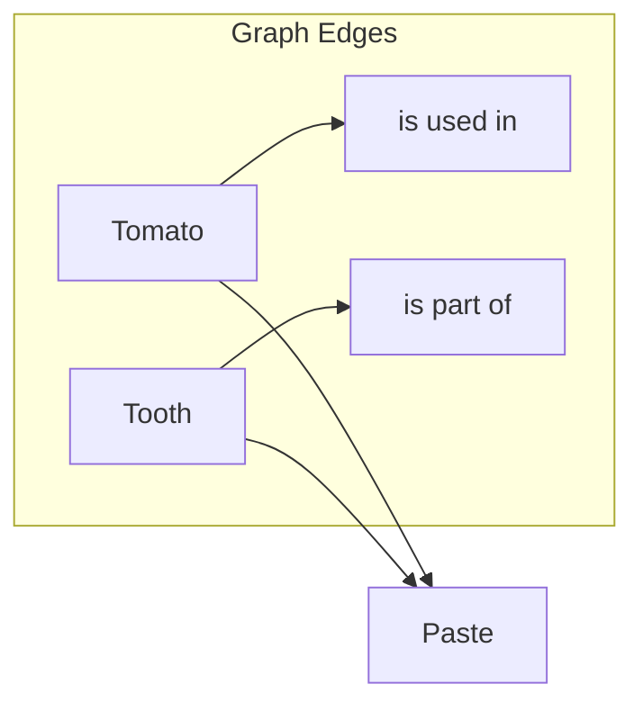

# Knowledge Graphs

## Core Idea

Knowledge graphs introduce directed, semantically labeled edges between concepts, adding context to pure embedding-based connections and disambiguating similar terms across domains.

## Embedding Ambiguity Example

Imagine a broad corpus containing recipes and healthcare documents. A naive embedding search for “paste” could return:

- **Tomato Paste** (cooking)
- **Toothpaste** (hygiene)

Because embeddings only capture proximity, both appear equally relevant. The result can be nonsensical mixed RAG completions (e.g., using toothpaste in pasta).

## Knowledge Graph Intervention

Knowledge graphs remedy this by adding semantic relations (edges) between entities:

When the query “What paste do I use to make pasta?” runs through the knowledge graph, the graph context “is used in cooking” filters out toothpaste, leaving only tomato paste.

## Combining Engines in RAG

In practice, RAG systems often blend multiple retrieval strategies (databases, embeddings, knowledge graphs) depending on:

- Data volume and update frequency
- Cost and latency of embedding/graph transformations
- Domain complexity and ambiguity

**Recommended approach:** Start with a simple database/API for grounding. If hallucinations or ambiguity persist, augment with embeddings or add a knowledge graph layer.

## Key Takeaway

Knowledge graphs enrich vector-based retrieval with explicit semantics, dramatically reducing ambiguity—especially in cross-domain scenarios.
