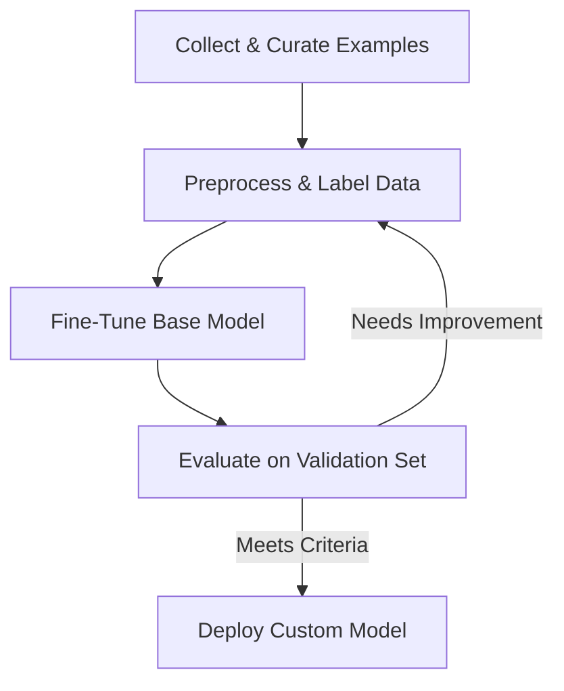

# Fine-Tuning

## Core Idea

Fine-tuning adapts a pre-trained LLM to your specific domain by training on curated prompt–response examples. The model internalizes desired behaviors and tone, reducing the need for elaborate runtime prompts.

## What Is Fine-Tuning?

Fine-tuning involves supplying a foundation model with many completed exchanges—each comprising a system message, a user prompt, and the ideal response. The model’s weights are adjusted so it learns to reproduce those patterns directly, instead of relying solely on in-chat instructions.

## Common Use Cases

- **Consistent Tone & Brand Voice:** Enforce corporate style and terminology without complex system prompts.  
- **Built-in Knowledge:** Embed standard replies (e.g., support contact info) so every response includes key facts.  
- **Structured Actions:** Automatically generate database/document references, code snippets, or predefined layouts.

## Challenges & Best Practices

- **Training Data Volume:** Effective fine-tuning often requires hundreds to thousands of high-quality examples.  
- **Compute & Cost:** Iterative training (multiple epochs) over large datasets can be resource-intensive.  
- **Model Drift & Validation:** Even fine-tuned models may stray from the intended behavior—rigorous evaluation and iterative testing are essential.

## Fine-Tuning Workflow

## Fine-Tuning vs RAG

| Scenario                          | RAG Preferred             | Fine-Tuning Preferred           |
|-----------------------------------|:-------------------------:|:-------------------------------:|
| Frequently changing source data   | ✅ Updated at query time   | ❌ Requires re-training          |
| Strict compliance & brand voice   | ❌ Varies by prompt        | ✅ Embedded in model weights     |
| Limited labeled examples          | ✅ Works with docs only    | ❌ Insufficient for tuning       |

## Key Takeaway

Fine-tuning provides precise, consistent control over model outputs at scale, but demands more labeled data, compute resources, and continuous validation. Combining fine-tuning (for consistency) with RAG (for dynamic grounding) often yields the best results.
