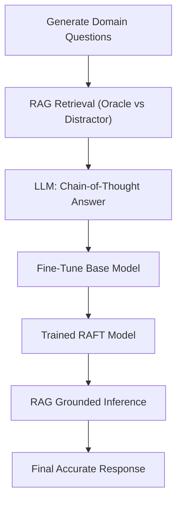
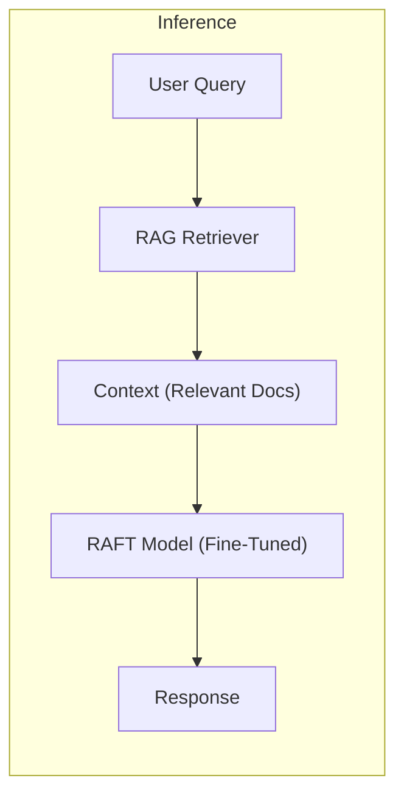

# RAFT: RAG with Fine-Tuning

## Core Idea

Retrieval Augmented Fine-Tuning (RAFT) combines RAG retrieval and fine-tuning in a loop: it uses RAG to generate domain‑specific training examples (with chain‑of‑thought reasoning), then fine-tunes the model on those examples so that later RAG‑powered inferences are even more accurate and pattern‑conformant.

## What Is RAFT?

RAFT addresses the challenge of grounding LLMs in specialized domain data (e.g., internal enterprise docs). The process:

1. Generate domain-specific questions matching anticipated user queries.
2. Use RAG to retrieve two classes of documents:
   - **Oracle docs:** contain the correct answer.
   - **Distractor docs:** irrelevant or misleading context.
3. Prompt the LLM with each question + its oracle docs to produce a detailed chain‑of‑thought answer (the reasoning + answer).
4. Fine-tune the base model on mixed training examples:
   - Question + oracle docs + correct chain‑of‑thought answer
   - Question + distractor docs + correct chain‑of‑thought answer
   - Question + mixed docs + correct chain‑of‑thought answer

This fine-tuned RAFT model learns to incorporate relevant context, ignore distractors, and discern which data to use for any new query.

## RAFT Workflow

## Training Example Types

- **Oracle Examples:** question + oracle docs + chain-of-thought answer
- **Distractor Examples:** question + distractor docs + chain-of-thought answer
- **Mixed Examples:** question + both docs + chain-of-thought answer

## Combined RAFT + RAG

Once fine-tuned via RAFT, the custom model still uses RAG retrieval at inference time, now imbued with an internalized pattern for selecting only relevant domain data.

## Key Takeaway

RAFT leverages LLM reasoning to auto-generate fine-tuning data, teaching the model to favor oracle information and dismiss distractors—yielding RAG inferences that are both accurate and domain‑aligned.
